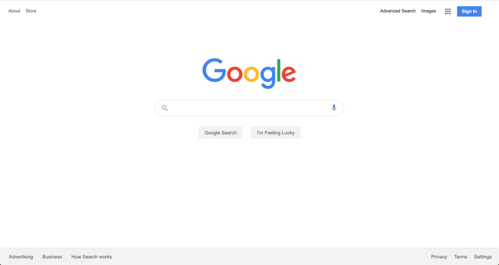
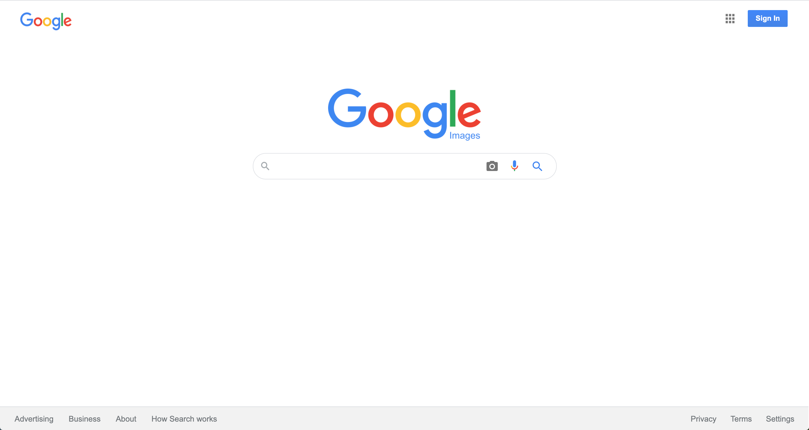
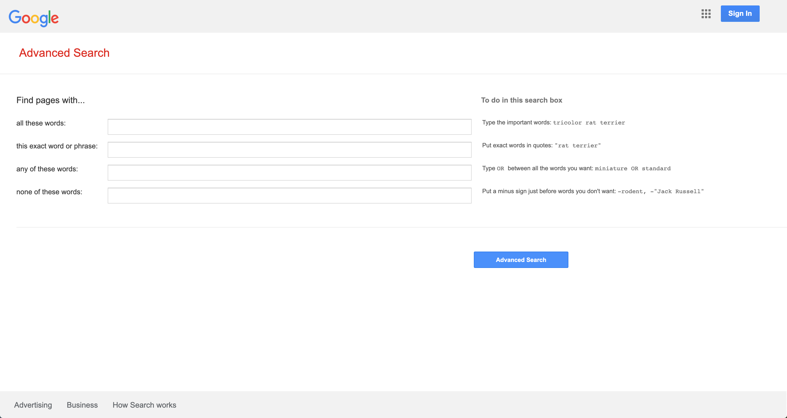

Designed a front end Google Search, Google Image Search and Google Advanced Search page with working query strings.

Used GET parameters in the search fields to send users to google's own results pages.

Replica of Google's Homepage:

The homepage give you the option to search google's results page or to get the top result using the "Feeling Lucky" button.

Replica of Google's Image Search Page:

Replica of Google's Advanced Search Page:

The advanced page mimics Google's own search behaviors. It will bypass the normal result pages to more specified searches.

I attempted to make my pages look strikingly similar to the real Google pages. I made sure the same hover, focus and other selectors were matching. I utilized Dev Tools in Chrome to match colors and certain specific styling.

In this project I used front-end tools, CSS and HTML as well as the terminal with git and DevTools.
